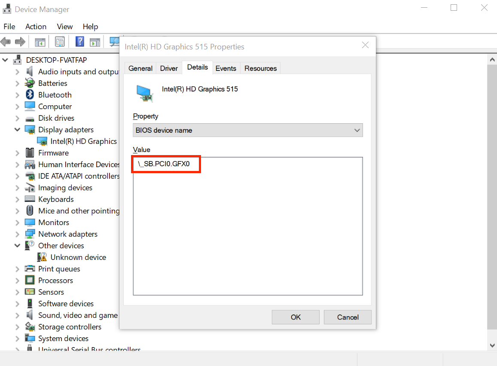
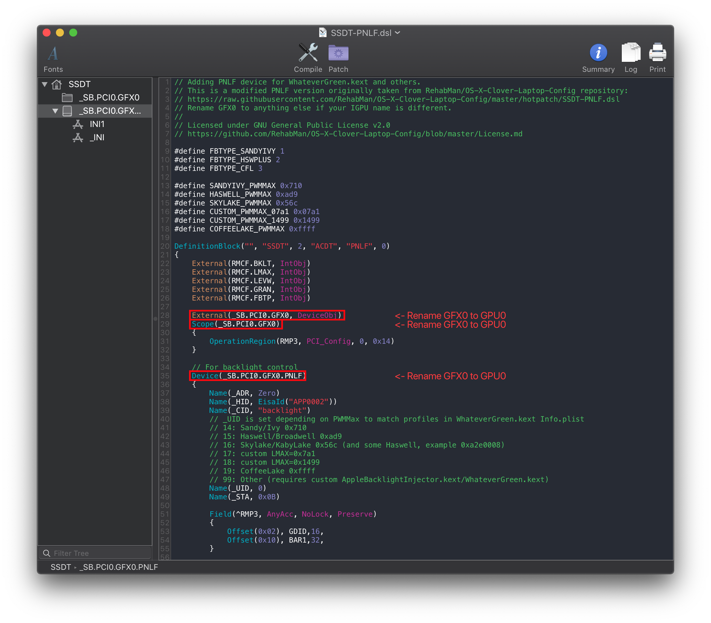

# Fixing Backlight: Manual

* [Finding the ACPI path](#finding-the-acpi-path)
* [Edits to the sample SSDT](#edits-to-the-sample-ssdt)
* [Compiling the SSDT](#compiling-the-ssdt)
* [Wrapping up](#wrapping-up)

## Finding the ACPI path

For this guide, we're gonna assume Windows is already on this laptop, as otherwise creating this SSDT is a bit more difficult.

Now open DeviceManager, and head to the following:

```
Device Manager -> Display Adapters -> Properties -> Details > BIOS device name
```

* Note some GPU ACPI pathing may be hiding under "BIOS device name"



From the above example, we can see our display is hooked up to `PCI0.GFX0`

## Edits to the sample SSDT

Now that we have our ACPI path, lets grab our SSDT and get to work:

* [SSDT-PNLF.dsl](https://github.com/acidanthera/WhateverGreen/blob/master/Manual/SSDT-PNLF.dsl)
* [SSDT-PNLF-CFL.dsl](https://github.com/dortania/Getting-Started-With-ACPI/blob/master/extra-files/decompiled/SSDT-PNLF-CFL.dsl.zip)
  * For Coffee Lake and newer

By default, this uses `PCI0.GFX0` for the pathing. you'll want to rename accordingly. For this example, we'll assume your pathing is `PCI0.GPU0`:

**Before**:

```
External (_SB_.PCI0.GFX0, DeviceObj) <- Rename this

Scope (_SB.PCI0.GFX0) <- Rename this

Device(_SB.PCI0.GFX0.PNLF) <- Rename this
```



Following the example pathing we found, the SSDT should look something like this:

**After**:

```
External (_SB_.PCI0.GPU0, DeviceObj) <- Renamed

Scope (_SB.PCI0.GPU0) <- Renamed

Device(_SB.PCI0.GPU0.PNLF) <- Renamed
```


## Compiling the SSDT

 With the SSDT done, you're now [ready to compile the SSDT!](/Manual/compile.md)

## Wrapping up

Once you're done making your SSDT, either head to the next page to finish the rest of the SSDTs or head here if you're ready to wrap up:

* [**Cleanup**](/cleanup.md)
