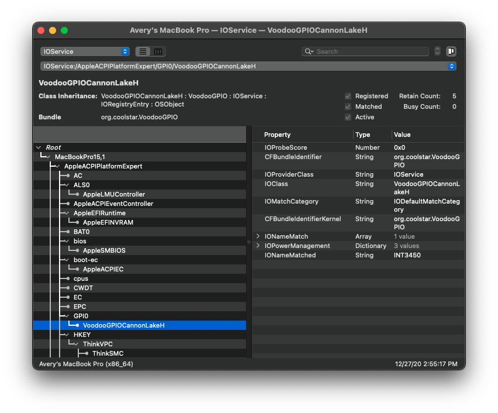
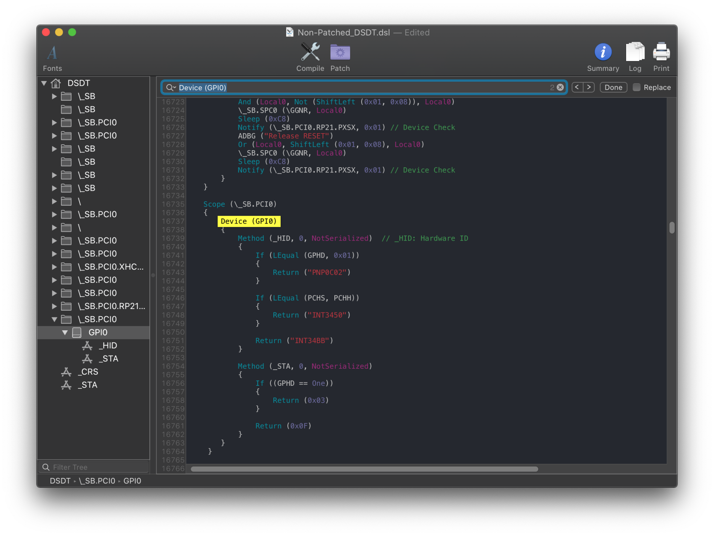
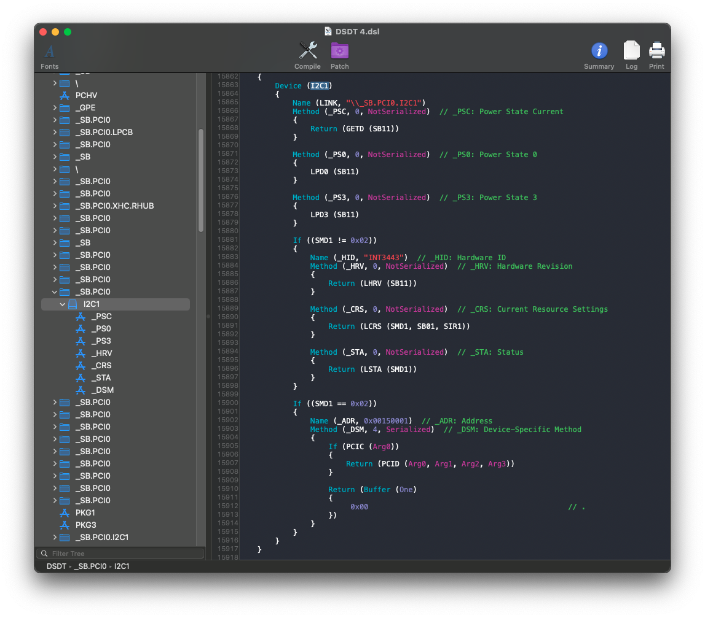
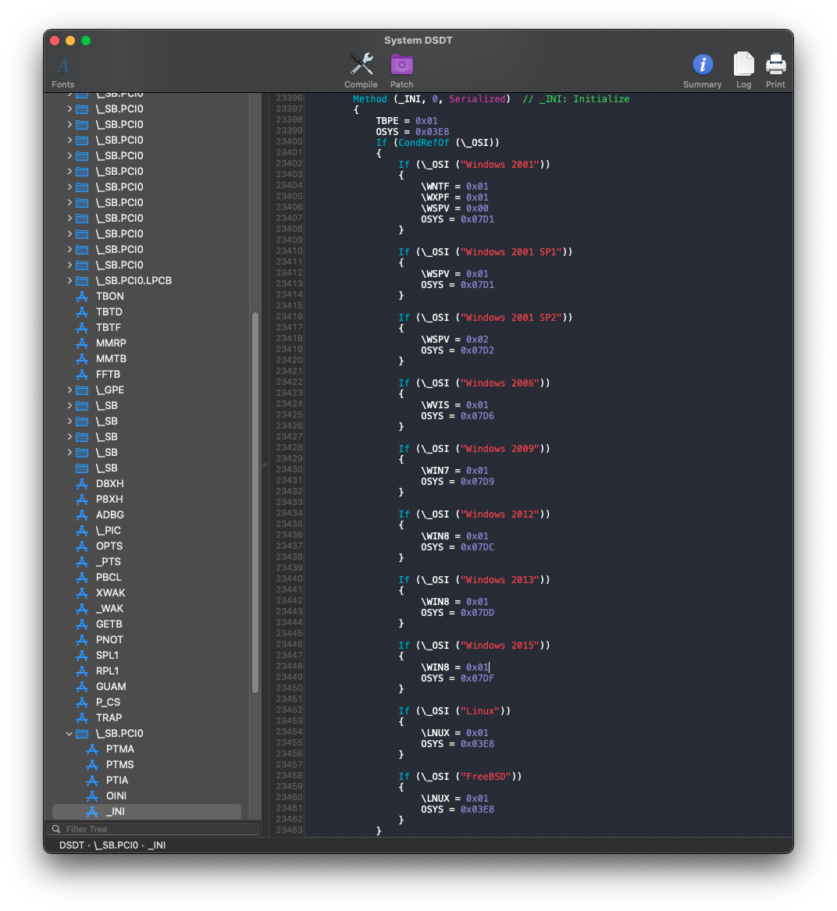

# Fixing Trackpads: Manual

* [Checking GPI0](#checking-gpi0)
* [Edits to the sample SSDT](#edits-to-the-sample-ssdt)
* [Enabling Trackpad](#enabling-trackpad)
* [Wrapping up](#wrapping-up)

## Checking GPI0

This page assumes that you have macOS installed as well as [IORegistryExplorer](https://github.com/khronokernel/IORegistryClone/blob/master/ioreg-302.zip).

The first thing to check is whether the GPI0 device exists, which is required for VoodooI2C. The best way to check this is working is to use IORegistryExplorer.



Here, we can see that VoodooGPIO is attached to GPI0 so no edits are needed for GPI0. If this is the case for you, you can skip to the [next section](#enabling-trackpad).

If VoodooGPIO isn't attached, then you may need to modify some values to enable the `GPI0` device. In that case, you will need to find the GPI0 device in your DSDT.

First open your decompiled DSDT you got from [Dumping the DSDT](/Manual/dump.md) and [Decompiling and Compiling](/Manual/compile.md) with either MaciASL (if in macOS) or any other text editor if in Windows or Linux (VSCode has an [ACPI extension](https://marketplace.visualstudio.com/items?itemName=Thog.vscode-asl) that can also help).

Next search for `Device (GPI0)`. You should get a result similar to this:


Below is the `_STA` method, which enables or disable the GPI0 device:

```
Method (_STA, 0, NotSerialized)
{
    If ((SBRG == Zero))
    {
        Return (Zero)
    }

    If ((GPEN == Zero))
    {
        Return (Zero)
    }

    Return (0x0F)
}
```

We want the value returned from _STA to be non-zero (0x0F in this case) to enable the `GPI0` device. If either `SBRG` or `GPEN` is equal to zero, then zero will be returned and `GPI0` will be disabled. Generally, `SBRG` should not be modified, as modifying it can break the `GPI0` device. Only modify `GPEN` if you need to enable the `GPI0` device.

Here's some more examples:


What we care about from this is the `_STA` method:

```
Method (_STA, 0, NotSerialized)
{
    If ((GPHD == One))
    {
        Return (0x03)
    }

    Return (0x0F)
}
```

Here we would want to set `GPHD` to `Zero` so that 0x0F is returned.

## Edits to the sample SSDT

Now that we know what variables need to be changed, lets grab our SSDT and get to work:

* [SSDT-GPI0.dsl](https://github.com/dortania/Getting-Started-With-ACPI/blob/master/extra-files/decompiled/SSDT-GPI0.dsl)

From the first example, we'll want to set GPEN to `One` to allow it to operate in macOS:

```
// This is likely already set in the SSDT-GPIO you just downloaded
If (_OSI ("Darwin"))
{
    GPEN = One
}
```

For the second example, you'd want to remove GPEN and use the below:

```
If (_OSI ("Darwin"))
{
    GPHD = Zero
}
```

You will want to test the SSDT at this point by [compiling the SSDT](/Manual/compile.md) and adding it to your config.plist. VoodooGPIO should now be attached to the GPI0 device as shown at the top of the GPI0 section. If your trackpad still doesn't work after enabling the `GPI0` device, move on to the next section.

## Enabling Trackpad

For some firmwares, the I2C devices check to see if they are running in Windows before enabling themselves. Similarly to the `GPI0` device, these devices contain a `_STA` method.

::: details _STA Example (Optional)



The part we care about is the `_STA` method:

```
Method (_STA, 0, NotSerialized)  // _STA: Status
{
    Return (LSTA (SMD1))
}
```

In this case, `_STA` is referring to another method, `LSTA`. If we search for `Method (LSTA`, we'll see the below:

```
Method (LSTA, 1, Serialized)
{
    If (((Arg0 == 0x00) || (Arg0 == 0x03)))
    {
        Return (0x00)
    }

    If (CondRefOf (OSYS))
    {
        If ((OSYS < 0x07DC))
        {
            Return (0x00)
        }
    }

    Return (0x0F)
}
```

The value `OSYS`, stores information about the current OS running. We will want to look for any place in which `OSYS` is set (`OSYS = 0x07DC` for example). In this DSDT, this is set under `\_SB.PCI0._INI` as shown below:



There are various checks for many different versions of Windows, but there is no check for `Darwin` (which Apple's ACPI usually checks for). We generally want to set `OSYS` to the highest possible value to enable the most features. In this case, the highest value is set when the version of Windows is "Windows 2015", or [Windows 10](https://docs.microsoft.com/en-us/windows-hardware/drivers/acpi/winacpi-osi#_osi-strings-for-windows-operating-systems). This means that we should set `OSYS` to `0x07DF`. Notice that this value is greater than `0x07DC`, which is the value that was checked for earlier. If we set `OSYS` to `0x07DF`, then the check in LSTA should return `0x0F`.

:::

The best way to patch these checks is to use _OSI to XOSI with SSDT-XOSI. You can also set `OSYS` within the scope of the I2C device, though this may not always work (The above example would not work here as LSTA is not within the scope of the I2C device).

### _OSI to XOSI

Requires the below SSDT and patch

* [SSDT-XOSI.dsl](https://github.com/dortania/Getting-Started-With-ACPI/blob/master/extra-files/decompiled/SSDT-XOSI.dsl) - If you need to edit [which versions of Windows the SSDT checks for](https://docs.microsoft.com/en-us/windows-hardware/drivers/acpi/winacpi-osi#_osi-strings-for-windows-operating-systems).
* [SSDT-XOSI.aml](https://github.com/dortania/Getting-Started-With-ACPI/blob/master/extra-files/compiled/SSDT-XOSI.aml) - Precompiled
* XOSI Rename (Add this under ACPI -> Patch in your config.plist):

| Comment | String | Change \_OSI to XOSI |
| :------ | :------ | :------- |
| Enabled | Boolean | YES      |
| Count   | Number  | 0        |
| Limit   | Number  | 0        |
| Find    | Data    | 5f4f5349 |
| Replace | Data    | 584f5349 |

::: details Dell Machines

You may need to add the below patch to allow the backlight keys to work.
Make sure that this patch appears **BEFORE** the previous \_OSI to XOSI patch in your config.plist
Credit to Rehabman for the below patch:

| Comment | String | Change \_OSID to XSID (to avoid match against \_OSI patch)
| :------ | :----- | :-------- |
| Enabled | Boolean | YES      |
| Count   | Number  | 0        |
| Limit   | Number  | 0        |
| Find    | Data    | 4F534944 |
| Replace | Data    | 58534944 |

:::

### Create OSYS Variable Under I2C Scope

You will need to find the device path where OSYS is checked, then create a new OSYS variable within that scope. This will only change OSYS for devices under this scope, which can allow for finer control over what is enabled. Note that in the example above, `LSTA` exists under `\_SB.PCI0.LSTA`, meaning that both `\_SB.PCI0._INI` and `\_SB.PCI0.LSTA` will control the same OSYS variable. If this is the case, this method will not work.

```
If (_OSI("Darwin")) {
    Scope (\_SB.PCI0.I2C0) { // I2C0 scope
        Name (OSYS, 0x7DF)
    }
}
```

::: tip Multiple Windows Versions

Windows will also return true for checks of earlier versions of Windows. For example, Windows 7 would return true for "Windows 2000" through "Windows 2009", but not any version after. This is important as some features are only enabled in earlier Windows checks. For example, DYTC thermal management on newer ThinkPads is only enabled in the check for "Windows 2001". You will need to check your own DSDT and see what values it sets and where they are used. At this point, you should [compiling the SSDT](/Manual/compile.md) and see if the trackpad works.

:::

## Further Setup

If you need further help getting your trackpad to work, then the best place to look is [VoodooI2C's readme](https://github.com/VoodooI2C/VoodooI2C)

## Wrapping up

Once you're done making your SSDT, either head to the next page to finish the rest of the SSDTs or head here if you're ready to wrap up:

* [**Cleanup**](/cleanup.md)
