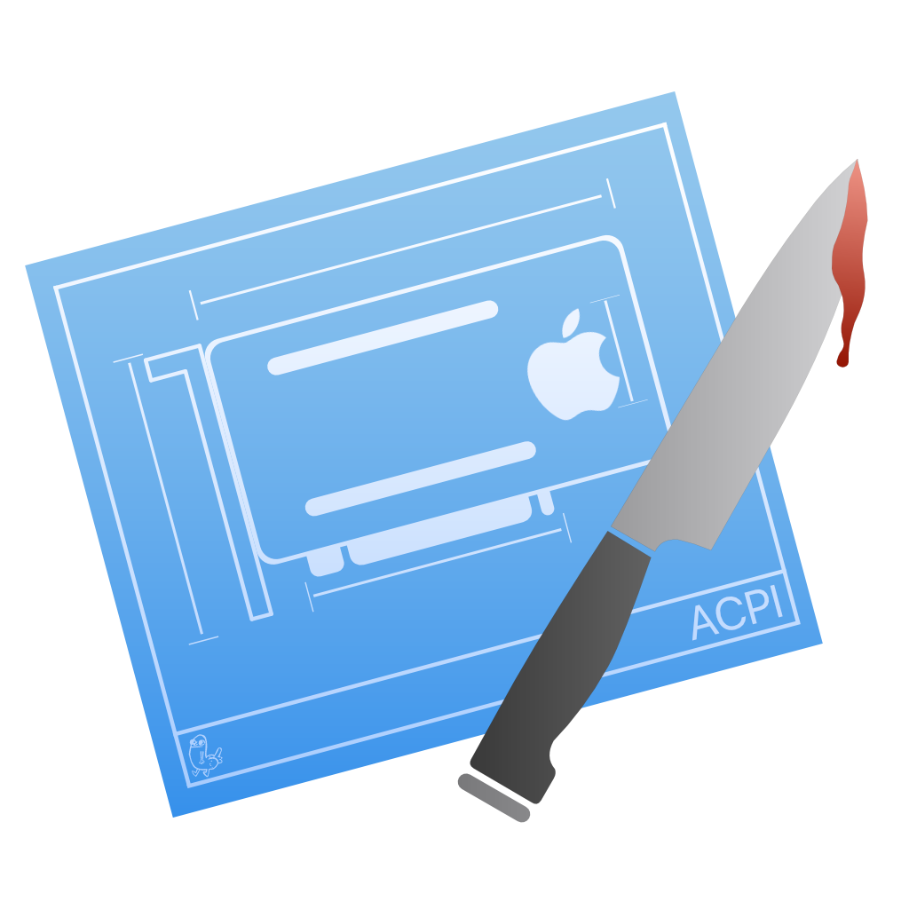

# Getting started with ACPI

## A quick explainer on ACPI

So what are DSDTs and SSDTs? Well, these are tables present in your firmware that outline hardware devices like USB controllers, CPU threads, embedded controllers, system clocks, and such. A DSDT(Differentiated System Description Table) can be seen as the body holding most of the info with smaller bits of info being passed by the SSDT(Secondary System Description Table). You can think of the DSDT as the building blueprints with SSDTs being sticky notes outlining extra details to the project

You can read more about ACPI and its spec here: [ACPI 6.4 Manual](https://uefi.org/sites/default/files/resources/ACPI_Spec_6_4_Jan22.pdf)

> So why do we care about these tables?

macOS can be very picky about the devices present in the DSDT and so our job is to correct it. The main devices that need to be corrected for macOS to work properly:

* Embedded controllers(EC)
  * All semi-modern Intel machines and most AMD systems have an EC (usually called H\_EC, ECDV, EC0, etc...) exposed in their DSDT. These controllers are generally not compatible with macOS and can cause panics, so they need to be hidden from macOS. macOS Catalina requires a device named `EC` to be present though, so a dummy EC is created.
  * To ensure that the battery and hotkeys work properly on laptops, it is important to keep the real embedded controller enabled. Renaming the EC can cause problems with Windows, so creating a fake EC while still keeping the real one active is a better option.
* Plugin type
  * This feature enables the utilization of XCPM, which facilitates the natural use of CPU power management on Intel Haswell and newer processors. The SSDT will connect to the first thread of the CPU. However, please note that this feature is not intended for use on AMD CPUs.
* AWAC system clock.
  * This applies to all 300 series motherboards including many Z370 boards, the specific issue is that newer boards ship with AWAC clock enabled. This is a problem because macOS cannot communicate with AWAC clocks, so this requires us to either force on the legacy RTC clock or if unavailable create a fake one for macOS to play with
* NVRAM SSDT
  * Motherboards in the True 300 series (excluding Z370) do not classify the FW chip as MMIO in ACPI, causing the kernel to overlook the MMIO area specified in the UEFI memory map. This SSDT brings back NVRAM support.
* Backlight SSDT
  * This is used to fix the backlight control support on laptops.
* GPIO SSDT
  * This tool is specifically used for creating a stub that enables VoodooI2C to connect, **For laptops *only***
* XOSI SSDT
  * This method redirects OSI calls to the SSDT and is primarily utilized to deceive our hardware into believing that it is running Windows, thereby improving trackpad support. However, this is a rather unreliable and unstable solution that can potentially cause issues with Windows boot. It is recommended to use the GPIO SSDT instead. Please note that the usage of XOSI will not be discussed in this guide.
* IRQ SSDT and ACPI patches
  * This is Needed for fixing IRQ conflicts within the DSDT, mainly for laptops. SSDTTime exclusive
  * It is rare for Skylake and newer systems to experience IRQ conflicts. This issue is more commonly experienced on Broadwell and older systems.
Proceed to the next page to determine which SSDTs your system needs.

## [Choosing the SSDTs](ssdt-platform.md)
