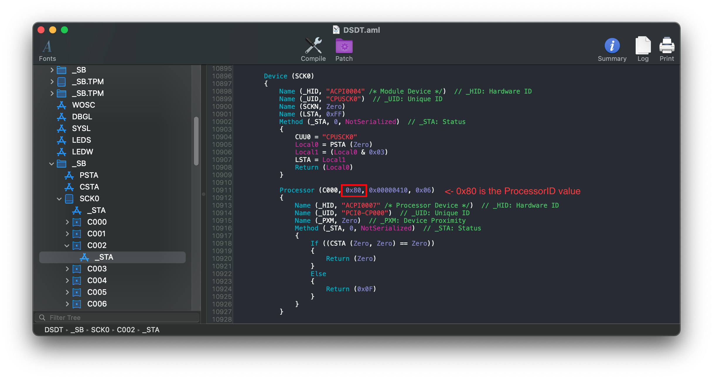
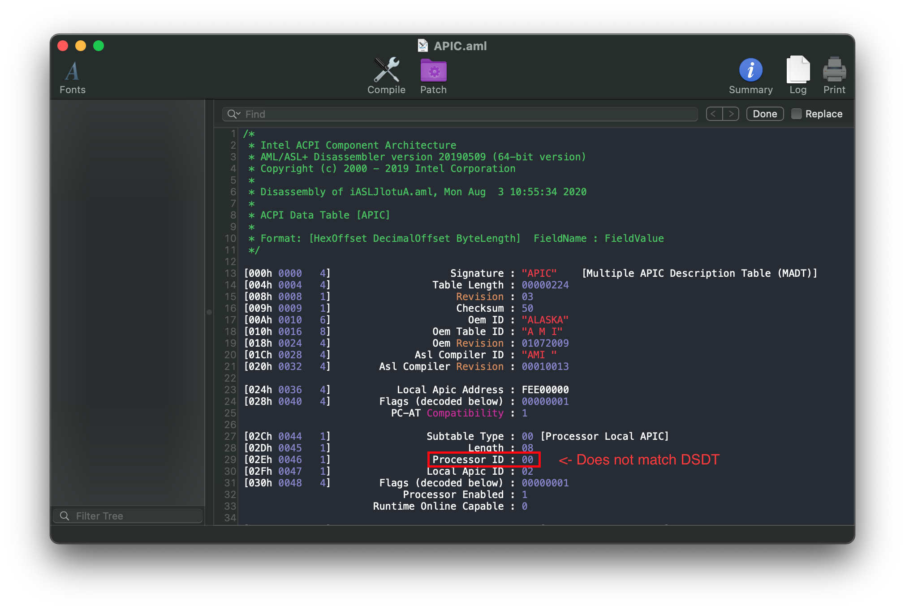
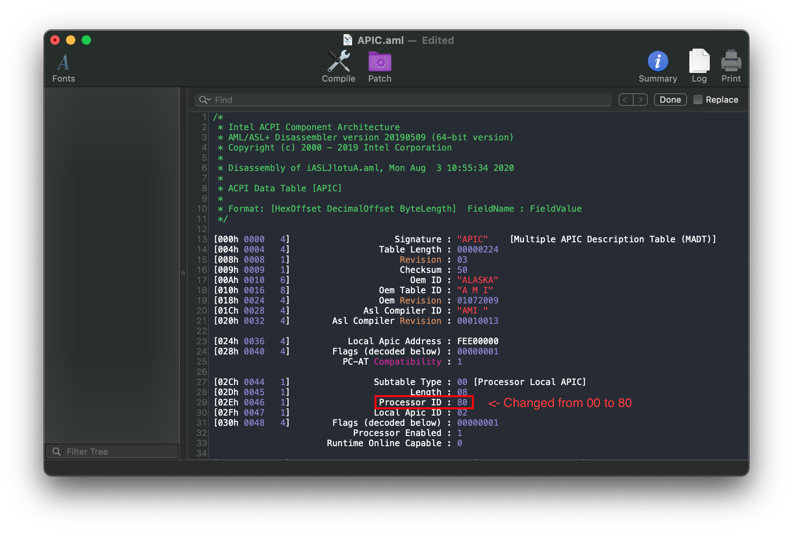
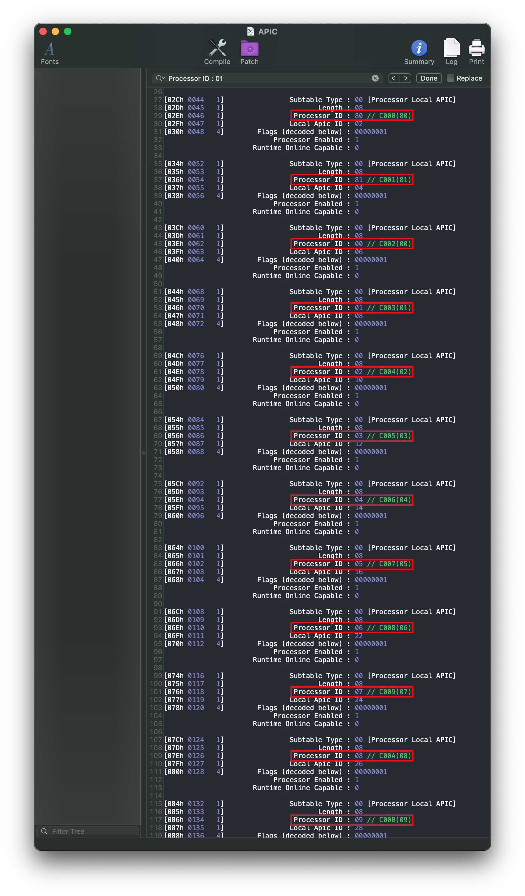
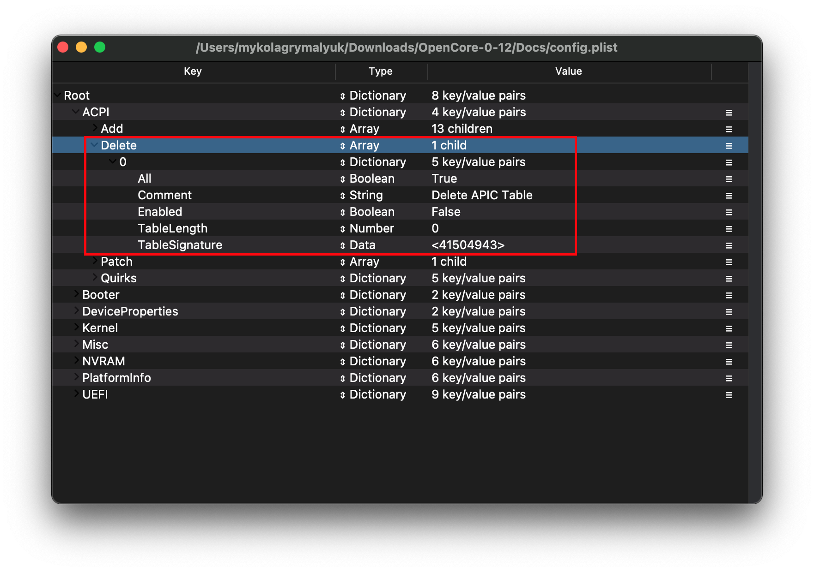

# Patching the APIC table

An odd issue some HEDT users may experience is a kernel panic relating to more cores defined in APIC than actually present:

```
panic(cpu 0 caller 0x......): "x86_validate topology() 32 threads but 33 registered from MADT~0/...
```

The reason for this kernel panic is due to macOS's assumption that the first CPU in ACPI is always enabled, which on servers and HEDT systems may not be always true.

To get around this, we want to patch our APIC table to point the first CPU entry to an active CPU.


## Dumping your DSDT and APIC tables

Dumping your DSDT and APIC table is quite easy, however some of the methods mentioned in [Getting a copy of our DSDT](../Manual/dump.md) may not provide you will all the needed files. Methods that will provide a full dump:

* acpidump.exe
  * Just run the program, don't give any specific arguments
* Clover's F4
* UEFI Shell using acpidump.efi
* OpenCore's SysReport quirk

And don't forget to follow the decompile guide as well: [Compiling and decompiling ACPI Tables](../Manual/compile.md)


## Examining our ACPI table

So lets take a look at our APIC table first:


Here we can see a list of all the CPU threads, and info about each one. Lets look at the first `[Processor Local APIC]` entry:

```c
[02Ch 0044   1]                Subtable Type : 00 [Processor Local APIC]
[02Dh 0045   1]                       Length : 08
[02Eh 0046   1]                 Processor ID : 00
[02Fh 0047   1]                Local Apic ID : 02
[030h 0048   4]        Flags (decoded below) : 00000001
                           Processor Enabled : 1
                      Runtime Online Capable : 0
```

Here we're given some important info, but the most important part:
```
Processor ID : 00
```

This value is what matches up the APIC's table entry to your DSDT, and is passed to macOS to determine the first CPU entry. And here we get a glimpse into what might be causing our kernel panic.

Next open your DSDT and search for `Processor`:


Here we're given some important info regarding the first CPU:

```c
Processor (C000, 0x80, 0x00000410, 0x06)
```

If we check the [ACPI Spec](https://uefi.org/sites/default/files/resources/ACPI_6_3_final_Jan30.pdf), section 19.6.108, we see the info is parsed as follows:

```c
Processor (ProcessorName, ProcessorID, PBlockAddress, PblockLength)
```


Now if we look at the `ProcessorID` section, we notice it's `0x80`, but this doesn't match up with the first entry in our APIC table (`00`). Now we can get a clearer idea of what's wrong with out APIC table and why it kernel panics.

**note** that your ACPI will very likely be much different, please look closely to what your values are

## Patching the APIC table

Now comes the fun part, were we actually have to re-arrange the APIC's `Processor ID` entries to properly match our DSDT. So to start, lets match up our CPU entry in our DSDT to our APIC.

| DSDT Entry | APIC Entry |
| :--- | :--- |
|  |  |


Here can see the DSDT and APIC's entry, and they are mismatched. While we could edit the DSDT, patching the APIC is far easier as its a much smaller file. So lets edit the file to properly reflect the DSDT:

* Note: While the DSDT is 0x80, the APIC does not need the 0x prefix so our final value in APIC would be simply 80



Now while we've fixed the initial kernel panic, we've likely created a new due to breaking the rest of the table. So we'll want to keep iterating through until the whole table's been fixed:



Once you've made all your edits, you'll next want to compile the file. See here for more details: [Compiling and decompiling ACPI Tables](../Manual/compile.md)

### Dropping the old APIC table

Before we can inject our newly patched APIC table, we'll need to first drop the old APIC table. To do this, you'll want to add a new entry to ACPI -> Delete:

| Key | Type | Value |
| :--- | :--- | :--- |
| All | Boolean | YES |
| Comment | String | Delete APIC Table |
| Enabled | Boolean | YES |
| TableLength | Number | 0 |
| TableSignature | Data | 41504943 |



If you do not have a config.plist yet, keep this Delete section in mind when you head back to the [install guide](https://dortania.github.io/OpenCore-Install-Guide/)

### Adding our newly patched APIC table

Quite simple, just add the APIC.aml file we compiled earlier to EFI/OC/ACPI and in your config.plist under ACPI -> Add. If you do not have a config.plist yet, you can head back to the install guide:

* [OpenCore Install Guide](https://dortania.github.io/OpenCore-Install-Guide/)


