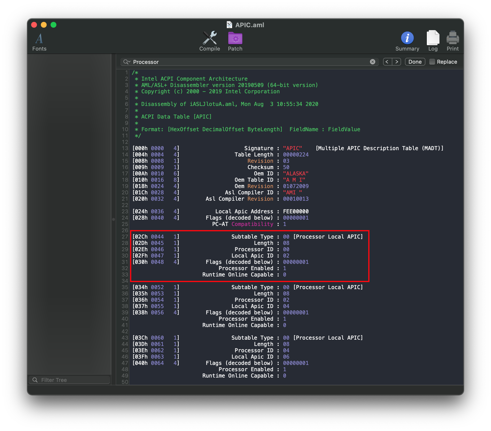
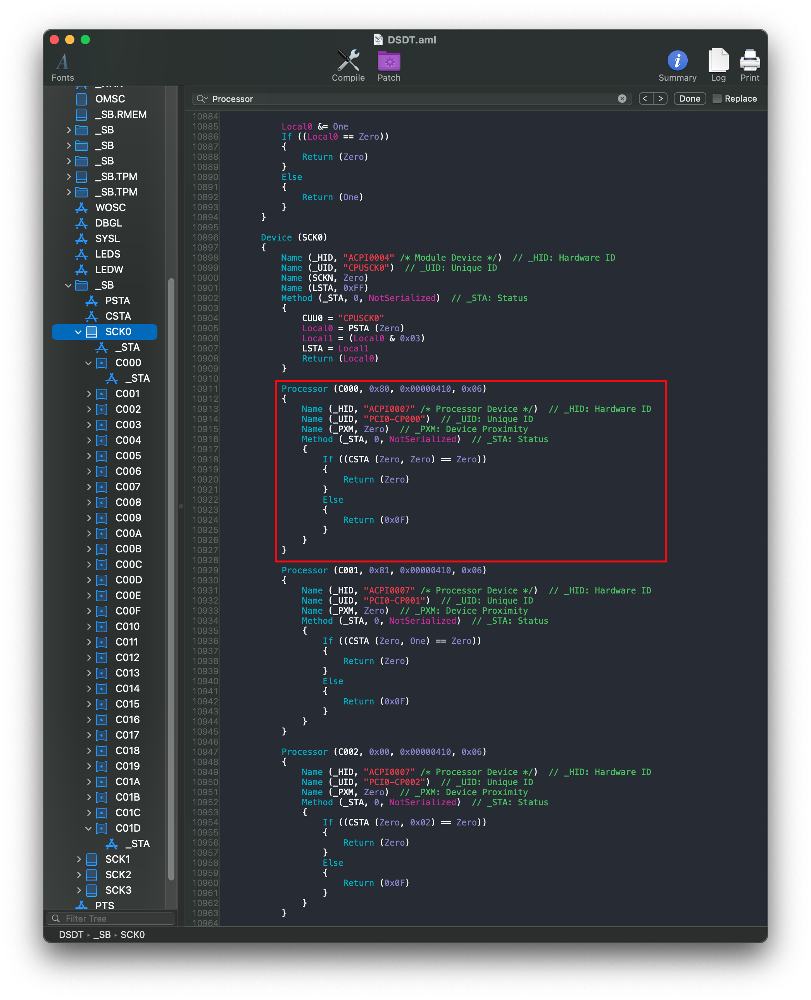

# Patching the APIC table

An odd issue some HEDT users may experience is a kernel panic relating to more cores defined in APIC than actually present:

```
panic(cpu 0 caller 0x......): "x86_validate topology() 32 threads but 33 registered from MADT~0/...
```

The reason for this kernel panic is due to macOS's assumption that the first CPU in ACPI is always enabled, which on servers and HEDT systems may not be always true.

To get around this, we want to patch our APIC table to point the first CPU entry to an active CPU.


## Dumping your DSDT and APIC tables

Dumping your DSDT and APIC table is quite easy, however some of the methods mentioned in [Getting a copy of our DSDT](../Manual/dump.md) may not provide you will all the needed files. Methods that will provide a full dump:

* acpidump.exe
  * Just run the program, don't give any specific arguments
* Clover's F4
* UEFI Shell using acpidump.efi
* OpenCore's SysReport quirk

And don't forget to follow the decompile guide as well: [Compiling and decompiling ACPI Tables](../Manual/compile.md)


## Examining our ACPI table

So lets take a look at our APIC table first:



Here we can see a list of all the CPU threads, and info about each one. Lets look at the first `[Processor Local APIC]` entry:

```
[02Ch 0044   1]                Subtable Type : 00 [Processor Local APIC]
[02Dh 0045   1]                       Length : 08
[02Eh 0046   1]                 Processor ID : 00
[02Fh 0047   1]                Local Apic ID : 02
[030h 0048   4]        Flags (decoded below) : 00000001
                           Processor Enabled : 1
                      Runtime Online Capable : 0
```

Here we're given some important info, but the most important part:
```
Processor ID : 00
```

This value is what matches up the APIC's table entry to your DSDT, and is passed to macOS to determine the first CPU entry. And here we get a glimpse into what might be causing our kernel panic.

Next open your DSDT and search for `Processor`:



Here we're given some important info regarding the first CPU:

```
Processor (C000, 0x80, 0x00000410, 0x06)
```

If we check the [ACPI Spec](https://uefi.org/sites/default/files/resources/ACPI_6_3_final_Jan30.pdf), section 19.6.108, we see the info is parsed as follows:

```
Processor (ProcessorName, ProcessorID, PBlockAddress, PblockLength)
```


Now if we look at the `ProcessorID` section, we notice it's `0x80`, but this doesn't match up with the first entry in our APIC table(`00`). Now we can get a clearer idea of what's wrong with out APIC table and why it kernel panics.

## Patching the APIC table
