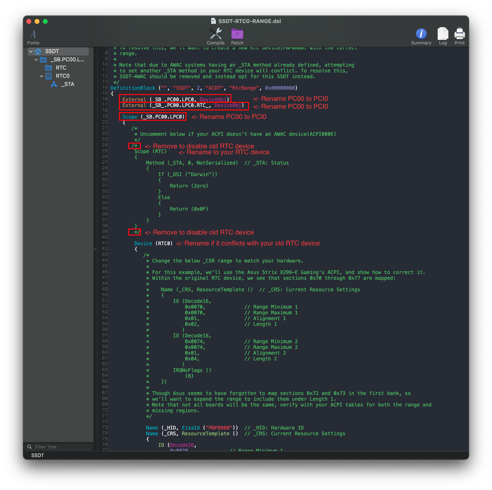

# Fixing System Clocks on HEDT: Manual

* [Finding the ACPI path](#finding-the-acpi-path)
* [Edits to the sample SSDT](#edits-to-the-sample-ssdt)
* [Compiling the SSDT](#compiling-the-ssdt)
* [Wrapping up](#wrapping-up)

## Seeing if you need SSDT-RTC0-RANGE

To start, first open your decompiled DSDT you got from [Dumping the DSDT](/Manual/dump.md) and [Decompiling and Compiling](/Manual/compile.md) with either MaciASL(if in macOS) or any other text editor if in Windows or Linux(VSCode has an [ACPI extension](https://marketplace.visualstudio.com/items?itemName=Thog.vscode-asl) that can also help).

Now search for `PNP0B00` and look at the `_CRS` entry within it:


And from the above example, we see we have 2 banks of RTC memory:

* Bank 1: starts at 0x70 and is length 0x2
* Bank 2: starts at 0x74 and is length 0x4

Now the problem is that the OEM forgot to mat sections 0x72 and 0x73. Because of this, macOS may halt while booting(prominently in Big Sur)

And finally, verify if it has an _STA method as well. This will be used shortly

## Finding the ACPI path

Finding the ACPI pathing is quite easy actually, first open your decompiled DSDT you got from [Dumping the DSDT](/Manual/dump.md) and [Decompiling and Compiling](/Manual/compile.md) with either MaciASL(if in macOS) or any other text editor if in Windows or Linux(VSCode has an [ACPI extension](https://marketplace.visualstudio.com/items?itemName=Thog.vscode-asl) that can also help).

To start, search for the following:

* Finding the RTC name:
  * Search `PNP0B00`
* Finding the LowPinCount path:
  * Search `Name (_ADR, 0x001F0000)`
* Finding the PCI path:
  * Search `PNP0A08` (If multiple show up, use the first one)

You should get something like the following show up:

RTC Pathing | LPC Pathing          |  PCI Pathing
:----------:|:-------------------------:|:-------------------------:
 |   |  

From the above, we can see we have `RTC`, `LPC0` and `PCI0`. Now we can head to the next stage

## Edits to the sample SSDT

Now that we have our ACPI path, lets grab our SSDT and get to work:

* [SSDT-RTC0-RANGE.dsl](https://github.com/acidanthera/OpenCorePkg/blob/master/Docs/AcpiSamples/SSDT-RTC0-RANGE.dsl)

By default, this uses `PC00.LPC0.RTC` for the pathing. you'll want to rename accordingly.

Following the example from above, we'll be renaming it to `PCI0.LPC0.RTC`:

**Before**:

```
External (_SB_.PC00.LPC0, DeviceObj) <- Rename this

External (_SB_.PC00.LPC0.RTC_, DeviceObj) <- Rename this

Scope (_SB.PC00.LPC0) <- Rename this
```



Following the example pathing we found, the SSDT should look something like this:

**After**:

```
External (_SB_.PCI0.LPC0, DeviceObj) <- Renamed

Scope (_SB.PCI0.LPC0.RTC) <- Renamed

Scope (_SB.PCI0.LPC0) <- Renamed


  /* <- Remove if your RTC device didn't have an _STA
  Scope (RTC)
        {
            Method (_STA, 0, NotSerialized)  // _STA: Status
            {
                If (_OSI ("Darwin"))
                {
                    Return (Zero)
                }
                Else
                {
                    Return (0x0F)
                }
            }
        }
  */ <- Remove if your RTC device didn't have an _STA
```


### Compiling the SSDT

 With the SSDT done, you're now [ready to compile the SSDT!](/Manual/compile.md)

## Wrapping up

Once you're done making your SSDT, either head to the next page to finish the rest of the SSDTs or head here if you're ready to wrap up:

* [**Cleanup**](/cleanup.md)
