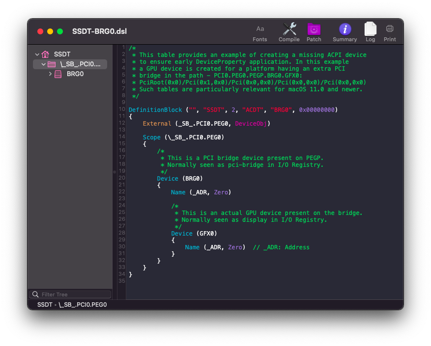

# Fixing Property Injection: Manual

* [Getting IORegistryExplorer](#getting-io)
* [Finding the ACPI path](#finding-the-acpi-path)
* [Edits to the sample SSDT](#edits-to-the-sample-ssdt)
* [Compiling the SSDT](#compiling-the-ssdt)
* [Wrapping up](#wrapping-up)

## Getting IORegistryExplorer

To find the ACPI path of your missing PCI bridge, we can use [IORegistryExplorer](https://developer.apple.com/downloads). Download the `Additional Tools for Xcode` package, IORegistryExplorer will be in the `Hardware` folder of the DMG.

## Finding the ACPI path

Open IORegistryExplorer, and search for your GPU. It may be called a number of different things, the most common names are `GFX0` and `display`. Once you find it, select it, your screen should look like one of these two images:

| No PCI bridge | Present PCI bridge |
| :-------------------------: | :-------------------------: |
|  |  |
| Doesn't need SSDT-BRG0 | May need SSDT-BRG0 |

At this point, if your IORegistry looks like the screenshot on the left, meaning your GPU is not attached to a PCI bridge, you're done and can move on to the [Wrapping Up](#wrapping-up) section, as you do not need SSDT-BRG0. If your GPU is attached to a PCI bridge like the screenshot on the right (worth noting that on your IORegistry, the bridge will almost certainly be called `pci-bridge`, not `BRG0`) then you may need SSDT-BRG0.

You can check for certain by looking for the `acpi-path` property of the PCI bridge. If there is no `acpi-path` property, you need SSDT-BRG0. If the `acpi-path` property exists, you do not need this SSDT and can continue to [Wrapping Up](#wrapping-up). To find the path to your GPU, look at the second dropdown at the top left of IORegistryExplorer that should contain a string starting with `IOService:/`. We need to look for substrings containing an @ symbol, these will be part of our final path.

In this example, the dropdown's text is `IOService:/AppleACPIPlatformExpert/PCI0@0/AppleACPIPCI/PEG0@1,2/IOPP/GFX0@0`. Since we need to prefix this with `_SB_`, our GPU's full path in this example would be `_SB_.PCI0.PEG0.GFX0`. However, in this SSDT we need to set the scope to just before both the GPU and PCI bridge, so we'd remove `GFX0`: `_SB_.PCI0.PEG0`. This will, of course, probably be different from what the path is on your system.

## Edits to the sample SSDT

Now that we have our ACPI path, lets grab our SSDT and get to work:

* [SSDT-BRG0.dsl](https://github.com/acidanthera/OpenCorePkg/blob/master/Docs/AcpiSamples/Source/SSDT-BRG0.dsl)

Once you've opened it up in your text editor or IDE of choice, replace the path in the `External` and `Scope` blocks with the path you found earlier. Make sure to keep the backslash prefix on the `Scope` block.

| Before | After |
| :-------------------------: | :-------------------------: |
|  |  |
| The after photo is an example based on the earlier screenshot. Edit the SSDT with your own path. |

## Compiling the SSDT

 With the SSDT done, you're now [ready to compile the SSDT!](/Manual/compile.md)

## Wrapping up

Once you're done making your SSDT, either head to the next page to finish the rest of the SSDTs or head here if you're ready to wrap up:

* [**Cleanup**](/cleanup.md)