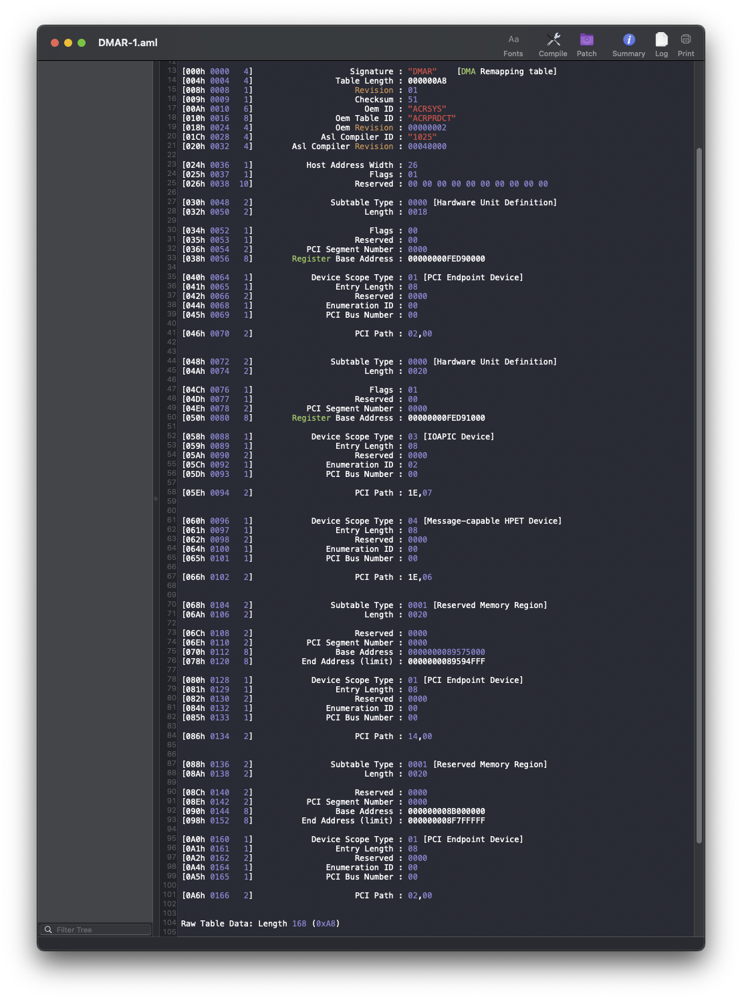
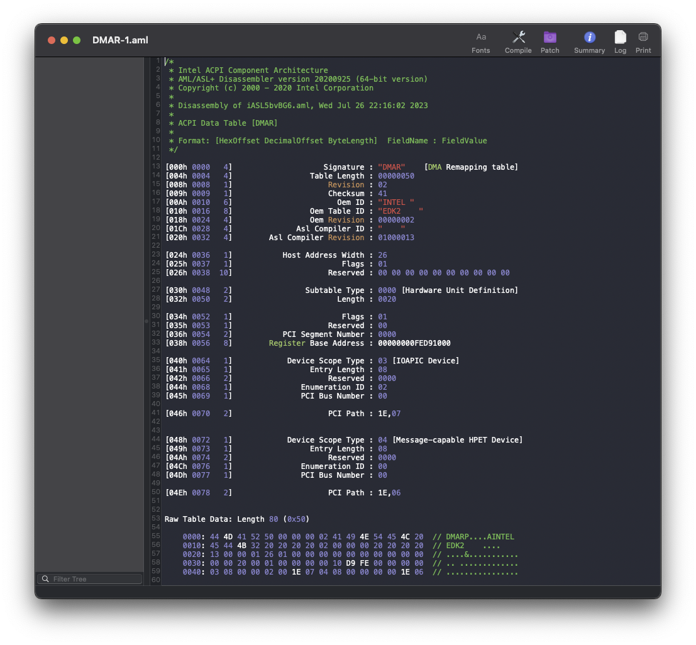
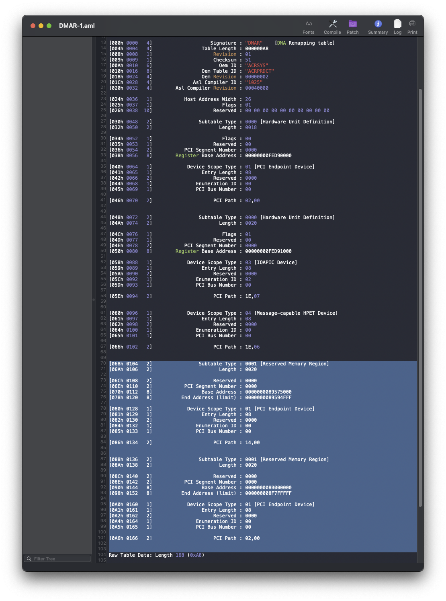

# Patching DMAR Table: Manual

What we will be doing is removing the Reserved Memory Regions to allow this table to load without conflicts in macOS - which is necessary for the following hardware devices:
* Intel I225 based Ethernet Controllers
* Aquantia Ethernet Controllers
* Some WiFi devices

## Preparation

First we need to gather files necessary to patch our DMAR Table.  If you've used the `SysReport` Quirk that is included with the Debug version of OpenCore, then you should have a `DMAR-1.aml` file residing inside your EFI Partition `SysReport/ACPI` folder, otherwise please follow the procedure [here](/Manual/dump.html#sysreport-quirk) to get started.  Once you have the file, it is best to store it in a safe location for easy access later on in this section.

## Manipulation

### Creating our Customized DMAR Table

Easiest way to manipulate the DMAR table is to use the GUI program MaciASL, this is a macOS only program, which can be acquired [here](https://github.com/acidanthera/MaciASL).  It is time to create our customized version of our original DMAR table with the Reserved Memory Regions removed.  So to start, we will open the copy of our `DMAR-1.aml` file we extracted from our system.

 | 
:-------------------------------:|:------------------:
Example of a DMAR Table with Reserved Memory Regions. | Example of a DMAR Table without Reserved Memory Regions

If your DMAR Table looks like Example #2 which has no Reserved Memory Regions, you can skip this guide and merely disable `DisableIoMapper` in your `config.plist`, and enable VT-d in your BIOS.

Now if your DMAR Table looks like Example #1, please continue below.

With our `DMAR-1.aml` file open, it is time to begin patching it, and do not worry this is pretty easy to do.  All we are doing is highlighting every section that is labelled `Reserved Memory Region` or Subtable Type of `0001` until you reach the next non-`0001` Subtable Type or when you reach the end of the file just like in the example below, and remove the entries entirely.

::: details Learn More

To learn more, you can read up on [DMA Remapping Table: "Intel® Virtualization Technology for Directed I/O"](https://software.intel.com/content/dam/develop/external/us/en/documents-tps/vt-directed-io-spec.pdf).

:::

The information starting with `Raw Table Data` at the end of the table is safe to remove as well if you choose to, this is merely raw binary table data and is only there for display.  When you Compile and Save as a new `ACPI Machine Language Binary`, this data is changed to reflect the new information in the binary table.

::: warning

**NOTE**: Do not confuse this with a SSDT, as that is a `Secondary System Description Table` which provides extra details for the actual DSDT.

:::

### Dropping the DMAR Table

Now you will need to prepare your `config.plist` for deleting or "dropping" the DMAR table.  This is done in the `ACPI->Delete` section.

::: tip Delete Code

| Comment        | String  | Drop DMAR Table |
| :------        | :------ | :-------------- |
| All            | Boolean | YES             |
| Enabled        | Boolean | YES             |
| TableSignature | Data    | 444D4152        |

::: warning

You must still conform to the OpenCore's `config.plist` schema, so make sure to consult with the [OpenCore Configuration](https://dortania.github.io/docs/release/Configuration.html) document for all required fields that must be present within `ACPI->Delete` and fill them in with their failsafe values.

:::

## Cleaning Up

Of course make sure your new patched `DMAR.aml` file is in your EFI Partition's `EFI/OC/ACPI` folder and also added to your `config.plist`.  Then disable `DisableIoMapper` under `Kernel->Quirks` and reboot.

If you are using a I225 based Ethernet Controller, and are utilizing `e1000=0` or `dk.e1000=0` for macOS 12.2.1 and below.  You will need to remove this boot-arg before rebooting so that `com.apple.DriverKit-AppleEthernetE1000` can match to your Intel I225-V Ethernet controller.
