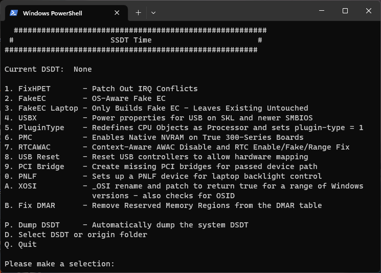

# SSDTs: The easy way

So here we'll be using a super simple tool made by CorpNewt: [SSDTTime](https://github.com/corpnewt/SSDTTime)

What this tool does is, it dumps your DSDT from your firmware, and then creates SSDTs based off your DSDT. **This must be done on the target machine running either Windows or Linux**

## So what **CAN'T** SSDTTime do

* **SSDT-GPI0**:
  * Need to be configured to your system
* **IMEI SSDT**:
  * If you have either a Sandy bridge CPU with 7 series motherboard or Ivy Bridge with 6 series motherboard, you'll need to either use the prebuilt or manually create it.

For users who don't have all the options available to them in SSDTTime, you can follow the "SSDTs: The long way" section. You can still use SSDTTime for SSDTs it does support.

## Running SSDTTime

Run the `SSDTTime.bat` file as Admin on the target machine and you should see something like this:

What are all these options?:

* `1. FixHPET - Patch out IRQ Conflicts`
  * IRQ patching, mainly needed for X79, X99 and laptop users(use option `C` to omit conflicting legacy IRQs)
* `2. FakeEC - OS-aware Fake EC`
  * This is the SSDT-EC, required for Catalina and newer users
* `3. FakeEC Laptop  - OS-aware Fake EC - Leaves Existing Untouched`
  * This is the SSDT-EC, but the laptop version only Builds Fake EC and leaves the existing EC devices untouched, again required for Catalina and newer users
* `4. USBX - Power properties for USB on SKL and newer SMBIOS`
  * This is the SSDT-USBX.  The prebuilt version can be used if desired, but SSDTTime can build a customizable version of SSDT-USBX.
* `5. PluginType - Sets plugin-type = 1 on First ProcessorObj`
  * This is the SSDT-PLUG, and can be used on Haswell and newer.  Will also check and redefine processor objects for 12th generation and newer Intel and AMD systems.
* `6. PMC - Sets Power Management controller status`
  * This is the SSDT-PMC, for Intel true 300+ series only, this device is missing from ACPI in recent boards and helps to bring back NVRAM support.
* `7. RTCAWAC - Context-Aware AWAC Disable and RTC Enable/Fake/Range Fix`
  * This is the SSDT-AWAC/RTC0, its purpose is to fix the system clocks found on newer hardware, and also enable, fake, and/or fix the RTC range.
* `8. USB Reset - Reset USB controllers to allow hardware mapping`
  * This is SSDT-RHUB, used for resetting USB ports in macOS for Asus's Z490 motherboards
* `9. PCI Bridge - Create missing PCI bridges for passed device path`
  * This will create missing PCI bridges necessary for passing device path.
* `0. PNLF - Sets up a PNLF device for laptop backlight control.`
  * This a customized SSDT-PNLF, tailored for the specific system.  This is not automatic and you must specify the generation of the iGPU.
* `A. XOSI - _OSI rename and patch to return true for a range of Windows versions - also checks for OSID`
  * This is SSDT-XOSI, can also create a patch for OSID and keep it in the correct order.
* `P. Dump DSDT  - Automatically dump the system DSDT`
  * Dumps your DSDT from your firmware

What we want to do is select option `P. Dump DSDT` first, then select the appropriate option(s) for your system.

> What about USBX?

For Skylake and newer plus AMD, you can either build SSDT-USBX with SSDTTime or grab a pre-built file here: [SSDT-USBX.aml](https://github.com/dortania/OpenCore-Post-Install/blob/master/extra-files/SSDT-USBX.aml). This file is plug and play and requires no device configuration, **do not use on Broadwell and older**.

**Troubleshooting note**: See [General Troubleshooting](https://dortania.github.io/OpenCore-Install-Guide/troubleshooting/troubleshooting.html) if you're having issues running SSDTTime

## Adding to OpenCore

### Manual Method

Don't forget that SSDTs need to be added to OpenCore, reminder that .aml is compiled, .dsl is code. **Add only the .aml file**:

* EFI/OC/ACPI
* config.plist -> ACPI -> Add

Reminder that Cmd/Ctrl+R with ProperTree pointed at your OC folder will add all your SSDTs, kexts and .efi drivers to the config for you. **Do not add your DSDT to OpenCore, its already in your firmware**. If you are unsure what this is referring to, go back to the OpenCore guide and select your config based of the architecture of your CPU.

For those who do not yet have a `config.plist`, you'll want to next head back to your respective OpenCore guides and create the config.plist:

* [OpenCore Install guide](https://dortania.github.io/OpenCore-Install-Guide/)

Users of `FixHPET`, `XOSI`, and `RTCAWAC` will also need to merge `oc_patches.plist` into their `config.plist`

Steps to do this:

* Open both files,
* Delete the `ACPI -> Patch` section from config.plist
* Copy the `ACPI -> Patch` section from patches.plist
* Paste into where old patches were in config.plist

### PatchMerge method

**NOTE:** This method does require that you have your `config.plist` already created.  If you have not done so, please start on the [OpenCore Install guide](https://dortania.github.io/OpenCore-Install-Guide/) before running this tool.

SSDTTime now includes a separate script called PatchMerge.  This script will automatically merge the patches you selected previously into your `config.plist`.

Run `PatchMerge.bat` you will be presented with this screen:

Select option `1. Select config.plist` to begin the process.  Once done, your patches will be stored in a `config.plist` inside the Results folder.  You will need to verify that copy of your `config.plist` with your existing one, making sure everything is intact and the patches inserted properly.  Then copy both the `config.plist` and the SSDTs from the Results folder to your `EFI/OC` and `EFI/OC/ACPI` folders respectively.
